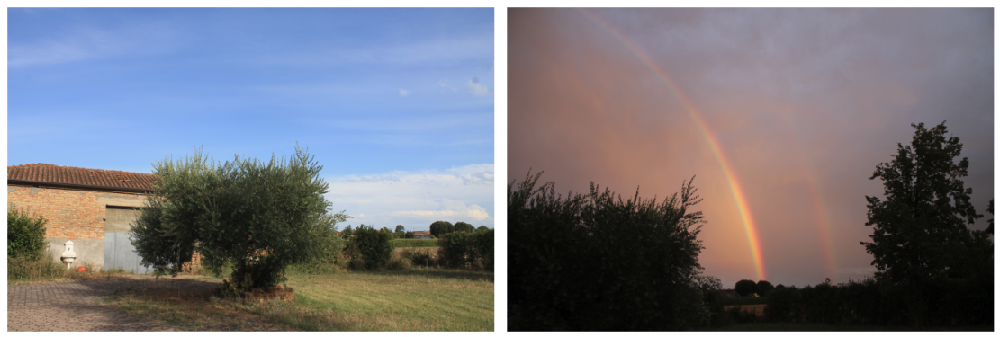
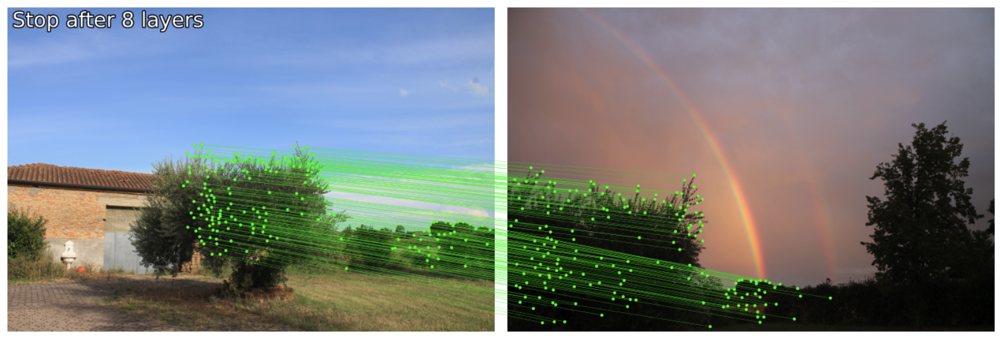
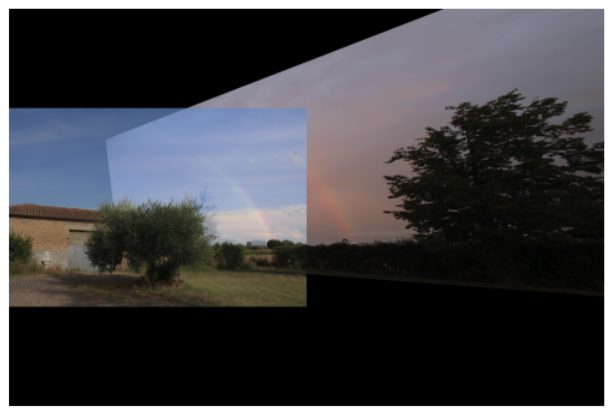

# Image Processing and Computer Vision Porject Work

## Homography estimation with LightGlue: Experiment Reproduction

**Goal**: Replicate the homography estimation experiment from the Lightglue paper using the HPatches dataset.

**Implementation Details**: This project evaluates the robustness and accuracy of LightGlue's transformer-based local feature matcher by estimating homographies between image pairs and comparing them with ground truth. Key components include keypoint detection (`SuperPoint`), feature matching (`LightGlue`), homography computation via `RANSAC/MAGSAC` and `DLT`, and quantitative evaluation using reprojection error. The setup follows the original paper's protocol, with direct benchmarking and visualization of matching quality under viewpoint and illumination changes.

### 📂 HPatches Dataset

The HPatches dataset is a widely adopted dataset for evaluating feature matching and homography estimation. Its structure makes it ideal for reproducible benchmarking:
- Consists of sequences of 5 image pairs, each under either illumination or viewpoint changes: two of the most challenging scenarios in real-world image matching.
- Provides ground truth homographies, allowing for accurate and objective evaluation of homography estimation performance.

### 🖼️ Example Images

 
   
   
  <em>Figure 1: Challenging image pair under viewpoint and illumination changes used for the test</em> 

 

 
   
   
  <em>Figure 2: Result of the feature extraction and matching using SuperPoint and LightGlue</em> 

 

 
  
   
  <em>Figure 3: Result of the homography estimation using LightGlue's feature matching</em> 

### 📖 References

- [LightGlue: Local Feature Matching at Light Speed](https://arxiv.org/abs/2306.16472), Philipp Lindenberger, Paul-Edouard Sarlin, Marc Pollefeys. ICCV 2023.
- [HPatches Dataset: A Benchmark and Evaluation of Handcrafted and Learned Local Descriptors](https://github.com/hpatches/hpatches-dataset?tab=readme-ov-file), Vassileios Balntas, Karel Lenc, Andrea Vedaldi, Krystian Mikolajczyk. CVPR, 2017.
